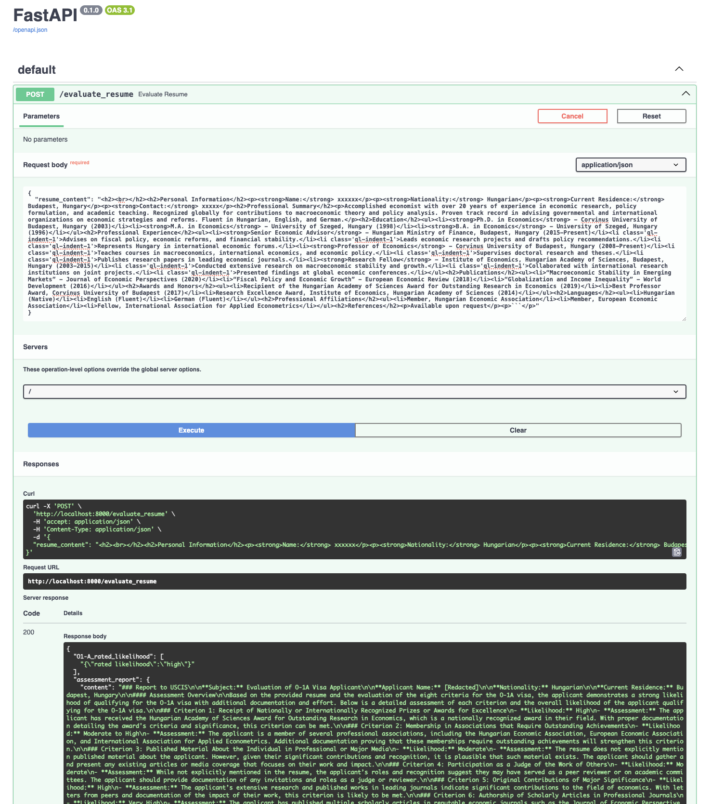

# AI ImmigrationOfficer

David Nordfors

## Purpose
The AI ImmigrationOfficer is an API that assesses a potential applicant's chances of successfully obtaining a US O1-A work visa. This assessment is based on a review of the candidate's resume. 

The AI mimics the role of a USCIS Immigration Officer, examining and evaluating the details provided in the resume.

The required input for this process is the candidate's resume (see example at the end of this README).

Upon completion, the API provides the following information:

* A preliminary rating of the applicant's potential for successfully obtaining an O1-A work visa, given that they are willing to engage in further efforts.
* A hypothetical internal assessment report from the AI immigration officer. 
* A fictitious letter from the AI immigration officer to the applicant, encouraging or discouraging the continuation of their efforts, and specifying what these efforts may entail.
* A comprehensive list of all messages exchanged with the AI, showing assessments of the resume concerning the individual USCIS evaluation criteria.
## ImmigrationOfficer Class

The ImmigrationOfficer is a Python class that simulates an automated immigration officer. It assesses the qualifications of an O-1A visa applicant based on their resume.

### Purpose

The purpose of the ImmigrationOfficer class is to automate the evaluation of a potential visa applicant's qualifications. It leverages the OpenAI API to simulate dialogues with the AI assistant, as would occur in OpenAI's chat model environment. Each stage in the evaluation process corresponds to a different kind of user message simulated by the ImmigrationOfficer class.

### Usage

1. Initialize the class with the applicant's resume:  
```imof = ImmigrationOfficer(resume)```
2. Call the evaluate_applicant() method to perform the evaluation:  
```imof.evaluate_applicant()```

### Public Methods
* `__init__(self, resume)`: Initializes the ImmigrationOfficer object with a resume. The resume should be formatted as a string, with newline characters separating different sections of the resume.
* `evaluate_applicant(self)`: This method performs the full evaluation of the applicant based on their resume. It simulates a series of user messages being passed to the OpenAI API, receives responses, and applies the information extracted from these responses.

### Outputs
After calling the evaluate_applicant method, the ImmigrationOfficer object contains the following properties:  
* `self.assessment_report`: The AI's assessment report for the applicant.
* `self.letter_to_candidate`: The AI-generated letter to the candidate, with encouragement or discouragement for continuing with the application process based upon the evaluation.
* `self.messages`: The full set of messages (both user and AI-generated) from the chat conversation.
* `self.rated_likelihood`: A rating of the overall likelihood that the applicant qualifies for the O1-A visa, generated using the 'rate_likelihood_for_O1-A_visa' tool provided by the OpenAI API.

### Find More Information

* For more information on O-1A extraordinary ability visas, check the USCIS website.
* Please be aware that actual visa decisions are complex and take into account more factors than this example covers. Always consult with a qualified attorney or immigration expert.
* Also, note that any usage of OpenAI's API must comply with their use case policy.

## FastAPI Integration



### API test
* URL:  
`http://localhost:8000/docs#/default/evaluate_resume_evaluate_resume_post`
* sample request body: 
```
{
  "resume_content": "<h2><br></h2><h2>Personal Information</h2><p><strong>Name:</strong> xxxxxx</p><p><strong>Nationality:</strong> Hungarian</p>
  <p><strong>Current Residence:</strong> Budapest, Hungary</p><p><strong>Contact:</strong> xxxxx</p><h2>Professional Summary</h2>
  <p>Accomplished economist with over 20 years of experience in economic research, policy formulation, and academic teaching. Recognized globally for contributions to macroeconomic theory and policy analysis. 
  Proven track record in advising governmental and international organizations on economic strategies and reforms. Fluent in Hungarian, English, and German.</p>
  <h2>Education</h2><ul><li><strong>Ph.D. in Economics</strong> - Corvinus University of Budapest, Hungary (2003)</li><li><strong>M.A. in Economics</strong> - University of Szeged, Hungary (1998)</li>
  <li><strong>B.A. in Economics</strong> - University of Szeged, Hungary (1996)</li></ul><h2>Professional Experience</h2><ul><li><strong>Senior Economic Advisor</strong> - Hungarian Ministry of Finance, Budapest, Hungary (2015-Present)</li>
  <li class='ql-indent-1'>Advises on fiscal policy, economic reforms, and financial stability.</li><li class='ql-indent-1'>Leads economic research projects and drafts policy recommendations.</li><li class='ql-indent-1'>Represents Hungary in international economic forums.</li>
  <li><strong>Professor of Economics</strong> - Corvinus University of Budapest, Hungary (2008-Present)</li><li class='ql-indent-1'>Teaches courses in macroeconomics, international economics, and economic policy.</li><li class='ql-indent-1'>Supervises doctoral research and theses.</li>
  <li class='ql-indent-1'>Publishes research papers in leading economic journals.</li><li><strong>Research Fellow</strong> - Institute of Economics, Hungarian Academy of Sciences, Budapest, Hungary (2003-2015)</li><li class='ql-indent-1'>Conducted extensive research on macroeconomic stability and growth.</li>
  <li class='ql-indent-1'>Collaborated with international research institutions on joint projects.</li><li class='ql-indent-1'>Presented findings at global economic conferences.</li></ul><h2>Publications</h2><ul><li>“Macroeconomic Stability in Emerging Markets” - Journal of Economic Perspectives (2020)</li>
  <li>“Fiscal Policy and Economic Growth” - European Economic Review (2018)</li>
  <li>“Globalization and Income Inequality” - World Development (2016)</li></ul><h2>Awards and Honors</h2><ul><li>Recipient of the Hungarian Academy of Sciences Award for Outstanding Research in Economics (2019)</li><li>Best Professor Award, Corvinus University of Budapest (2017)</li>
  <li>Research Excellence Award, Institute of Economics, Hungarian Academy of Sciences (2014)</li></ul><h2>Languages</h2><ul><li>Hungarian (Native)</li><li>English (Fluent)</li><li>German (Fluent)</li></ul><h2>Professional Affiliations</h2><ul><li>Member, Hungarian Economic Association</li>
  <li>Member, European Economic Association</li><li>Fellow, International Association for Applied Econometrics</li></ul><h2>References</h2><p>Available upon request</p><p>```</p>"
}
```


